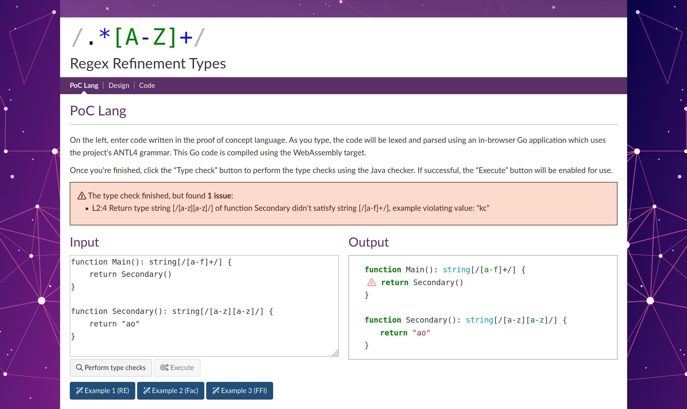

# Regular Expression Refinement Types

Dissertation project submitted as part of _BSc Computer Science with Intercalated Year_ at the _University of Warwick_.

<dl>
  <dt>Project classification</dt><dd>1st (85%)</dd>
  <dt>Project supervisor</dt><dd>Michael Gale</dd>
</dl>

## Introduction

Entire classes of modern web application vulnerabilities arise due to problematic user input handling. This includes cross-site scripting (XSS), _injection_ issues (SQL, LDAP, etc.), insecure deserialisation and file inclusion vulnerabilities – all of which are encountered by information security firms on a regular basis in application assessments.

This project explores the use of regular expressions as refinement types for constrained data in order to model user input validation. The type system of a prototype imperative language is formalised and implemented using ANTLR4 and a Java interpreter.

This repository includes:

* TeX sources for the written components of the project required by the university
  * Project specification
  * Progress report (completed part-way through the project)
  * Final report
* Code powering the toy language
  * [ANTLR4](https://www.antlr.org/) grammar and lexer
  * [Pygments](http://pygments.org/)-compatible syntax highlighter
  * Web application frontend to allow experimentation with the language (using the university's [ID7 identity](https://id7.warwick.ac.uk/))
  * [Rise4fun](https://rise4fun.com/)-API implementation
  
### Tooling used for report

High-quality printed results were achievable without proprietary software, using the following tools:

* [LuaTeX](http://www.luatex.org/)
* [TeXiFy-IDEA](https://github.com/Hannah-Sten/TeXiFy-IDEA) and [IntelliJ IDEA](https://www.jetbrains.com/idea/) platform
* [TikZ](https://ctan.org/pkg/pgf)
* [Minted](https://ctan.org/pkg/minted)
* [Scribus](https://www.scribus.net/)

### Wider impact

A formal academic project of reasonable length is a great opportunity to contribute knowledge back into the public domain. As well as open sourcing this repository (including the code and report), a number of existing open source projects and articles received contributions during the project.

**Wikipedia Contributions:**

* New articles: [Liquid Haskell](https://en.wikipedia.org/wiki/Liquid_Haskell), [DPLL(T)](https://en.wikipedia.org/wiki/DPLL(T))
* Contributions to existing articles: [Refinement type](https://en.wikipedia.org/wiki/Refinement_type) (addition of _History_ section), [DPLL](https://en.wikipedia.org/wiki/DPLL_algorithm#The_algorithm) (explaining algorithm termination)

**Open Source Contributions:**

* PR'd improvements to [TeXiFy-IDEA](https://github.com/Hannah-Sten/TeXiFy-IDEA/pulls?utf8=%E2%9C%93&q=is%3Apr+author%3Alol768)
* Bug report (Java mappings) on [Microsoft's Z3](https://github.com/Z3Prover/z3/issues/1944)
* [Discussion](https://github.com/gpoore/minted/issues/230) around Minted and `escapeinside`

**TeX.SE Q&A**

* [Custom Pygments styles with Minted](https://tex.stackexchange.com/questions/482623/custom-pygments-styles-in-minted-not-taking-effect)
* [Minted, escapeinside workarounds](https://tex.stackexchange.com/questions/483681/hide-minted-output-completely-without-taking-up-space)
* [Chomsky hierarchy diagram with TikZ](https://tex.stackexchange.com/questions/484541/nested-ellipses-in-tikzpicture-chomsky-hierarchy)
* [Derivation tree for grammars](https://tex.stackexchange.com/questions/484679/derivation-tree-not-rendering)

DCS Plagiarism Policy
---------------------

Midway through the final course year within the Department of Computer Science, the handbook was updated with the following policy (~6 months after it was electronically signed):

> It is becoming increasingly common for students to use repositories (such as GitHub and GitLab) to store and manage their coursework. If you do this, you must make sure that your repositories are marked as "private" (and remain so, even after you have left the University), since by default they may be public and may be seen by other students. If you make your coursework public, and it is viewed or copied by other students, you may be investigated for abetting plagiarism (just as if you had deliberately handed your work to another student to copy).
> 
> If you need to make a "portfolio" visible to potential employers, then the above still holds - either give the employer individual access (if the repository allows it), or make sure no source code is included.

To the best of my knowledge, no intellectual property in this repository is owned by the Department of Computer Science. It is unfortunate that an attempt was made to introduce such an all-encompassing policy without consultation.

In the case of this repository, a 'common sense' approach has been taken when open sourcing it in spite of this policy: the risk of plagiarism seems reasonably low, given that students are expected to come up with their own project ideas for the module. 
